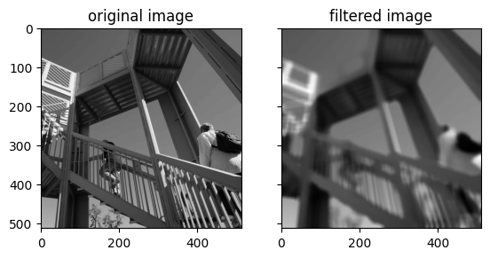

# ndfilters

[](https://github.com/byrdie/ndfilters/actions/workflows/tests.yml)
[](https://codecov.io/gh/sun-data/ndfilters)
[](https://ndfilters.readthedocs.io/en/latest/?badge=latest)
[](https://badge.fury.io/py/ndfilters)

Similar to the filters in `scipy.ndimage` but accelerated using `numba`.

## Installation

`ndfilters` is published on PyPI and can be installed using `pip`.

```bash
pip install ndfilters
```

The only filter currently implemented is a trimmed mean filter. This filter ignores a given portion of the dataset before calculating the mean at each pixel.


```python
import matplotlib.pyplot as plt
import scipy.datasets
import ndfilters

img = scipy.datasets.ascent()
img_filtered = ndfilters.trimmed_mean_filter(img, kernel_shape=21)

fig, axs = plt.subplots(ncols=2, sharex=True, sharey=True)
axs[0].set_title("original image");
axs[0].imshow(img, cmap="gray");
axs[1].set_title("filtered image");
axs[1].imshow(img_filtered, cmap="gray");
```

    Downloading file 'ascent.dat' from 'https://raw.githubusercontent.com/scipy/dataset-ascent/main/ascent.dat' to '/home/runner/.cache/scipy-data'.


    

    

